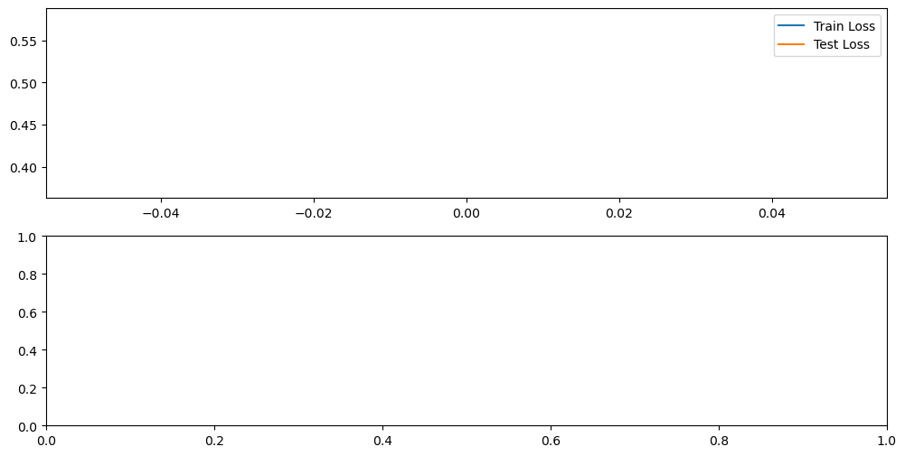
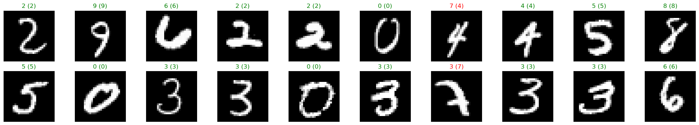

```python
import torch
import torch.nn as nn
import matplotlib.pyplot as plt
import numpy as np
import torch.nn.functional as F
from torchvision import datasets, transforms
from torch.utils.data import DataLoader
from Optimiser.GeoAdaler import Geoadaler
from helpers import loss_graph
from IPython.display import clear_output
```


```python
device = torch.device("cuda:0" if torch.cuda.is_available() else "cpu")
print(device)
```

    cuda:0


# MNIST Dataset example


```python
# Load the MNIST dataset
transform = transforms.Compose([transforms.ToTensor(), transforms.Normalize((0.5,), (0.5,))])
trainset = datasets.MNIST('mnist_data/', download=True, train=True, transform=transform)
trainloader = DataLoader(trainset, batch_size=16, shuffle=True)
testset = datasets.MNIST('mnist_data/', download=True, train=False, transform=transform)
testloader = DataLoader(testset, batch_size=64, shuffle=True)
```

# Model


```python
class Model(nn.Module):
    def __init__(self):
        super(Model, self).__init__()
        self.fc1 = nn.Linear(784, 128)
        self.fc2 = nn.Linear(128, 64)
        self.fc3 = nn.Linear(64, 10)
    
    def forward(self, x):
        x = x.view(x.shape[0], -1)
        x = F.relu(self.fc1(x))
        x = F.relu(self.fc2(x))
        x = self.fc3(x)
        return x
    
def model_test(model, testloader):
    correct = 0
    total = 0
    with torch.no_grad():
        running_loss = 0.0
        for images, labels in testloader:
            images, labels = images.to(device), labels.to(device)
            output = model(images)
            _, predicted = torch.max(output, 1)
            total += labels.size(0)
            correct += (predicted == labels).sum().item()
            running_loss += loss.item()
        test_loss = running_loss / len(testloader)
    
    return test_loss,correct / total
```


```python
# Model training
model = Model().to(device)
criterion = nn.CrossEntropyLoss()
optimiser = Geoadaler(model.parameters(), lr=0.01)
train_loss = []
test_loss_ = []
accuracy_=[]

for epoch in range(10):
    running_loss = 0
    for images, labels in trainloader:
        images, labels = images.to(device), labels.to(device)
        optimiser.zero_grad()
        output = model(images)
        loss = criterion(output, labels)
        loss.backward()
        optimiser.step()

        running_loss += loss.item()
    
    train_loss.append(running_loss / len(trainloader))   
    test_loss, accuracy = model_test(model, testloader)
    test_loss_.append(test_loss)
    accuracy_.append(accuracy)
    clear_output(wait=True)
    loss_graph(train_loss, test_loss, accuracy,epoch)
    #print(f"Epoch {epoch+1}, Loss: {loss.item()}")
```


    ---------------------------------------------------------------------------

    TypeError                                 Traceback (most recent call last)

    Cell In[30], line 26
         24 accuracy_.append(accuracy)
         25 clear_output(wait=True)
    ---> 26 loss_graph(train_loss, test_loss, accuracy,epoch)
         27 #print(f"Epoch {epoch+1}, Loss: {loss.item()}")


    File ~/Examples/Geoadaler/helpers.py:12, in loss_graph(train_loss, test_loss, accuracy, iteration, optim_name)
         10 ax1.plot(test_loss, label='Test Loss')
         11 ax1.legend(loc='upper right')
    ---> 12 ax1.scatter(range(len(test_loss)), test_loss, color='red', label='Test Loss')
         13 ax1.scatter(range(len(accuracy)), train_loss, color='blue', label='Train Loss')
         14 ax1.set_title('%s Epoch: %d' % (optim_name,iter+1))


    TypeError: object of type 'float' has no len()


    

    


```python
# Model evaluation
test_loss,accuracy=model_test(model, testloader)

    
print(f"Accuracy: {100 *accuracy}%")
```

    Accuracy: 97.16%


```python
# predictions


images, labels = next(iter(testloader))
images, labels = images.to(device), labels.to(device)
output = model(images)
_, predicted = torch.max(output, 1)

fig = plt.figure(figsize=(25, 4))
for idx in np.arange(20):
    ax = fig.add_subplot(2, 10, idx+1, xticks=[], yticks=[])
    ax.imshow(images[idx].cpu().numpy().squeeze(), cmap='gray')
    ax.set_title(f"{predicted[idx]} ({labels[idx]})", color=('green' if predicted[idx] == labels[idx] else 'red'))

plt.show()
```


    

    

